# New Image Construction & Remodeling — lo que hace especial al sitio

Capturas de pantalla del sitio en vivo (`newimageremodeling.co`), organizadas
para mostrar qué lo diferencia de una página de construcción genérica.

Esta carpeta vive en `tools/` a propósito: ese directorio está excluido del
build que se despliega (ver `.github/workflows/deploy.yml`), así que estas
capturas quedan en el repo para referencia interna, pero nunca se publican
en el sitio real.

---

## 1. Hero cinemático — scroll como si fuera una película

En vez de un video de fondo típico, el hero es una **secuencia de 120
imágenes** que se dibujan en un `<canvas>` sincronizadas con el scroll: cada
pixel que el usuario baja avanza el "video" un poco más. Esto evita por
completo el lag de reproducir/buscar video que sufren los navegadores
(especialmente Safari) con el truco clásico de `<video>` + `currentTime`.

La narrativa está dividida en capítulos que aparecen y desaparecen con la
misma métrica de scroll:

| Intro | Concept → Build |
|---|---|
| 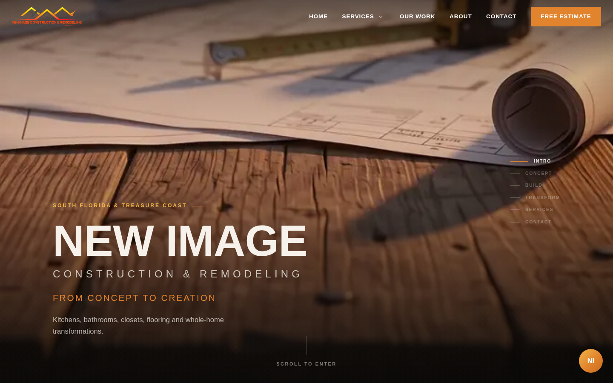 | 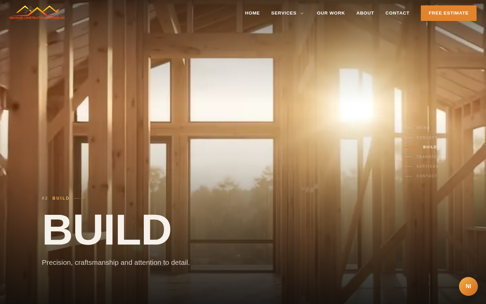 |

| Transform | Cierre con CTA |
|---|---|
| 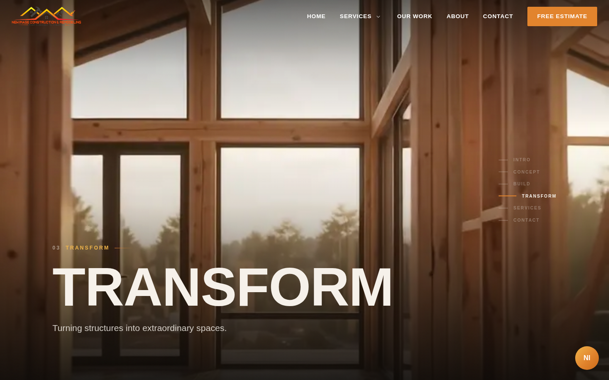 | 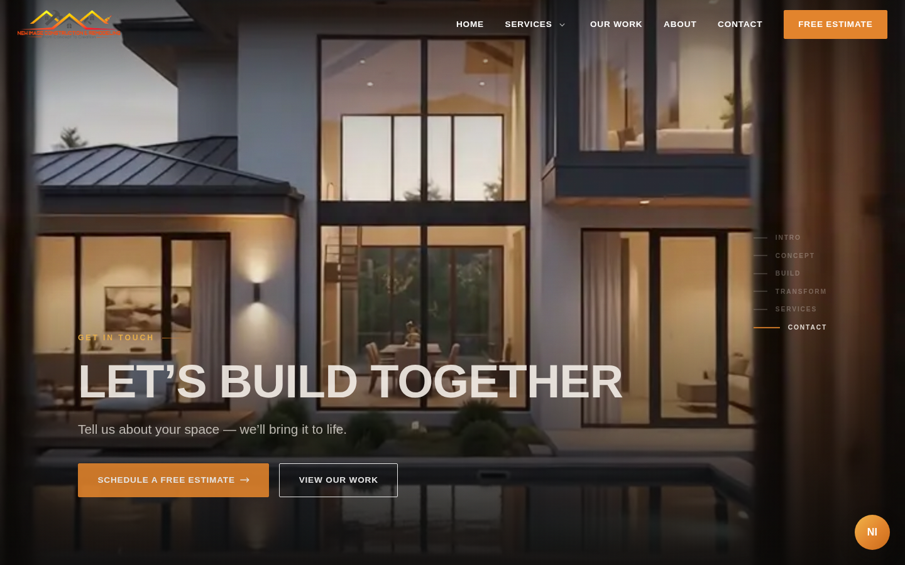 |

El riel lateral ("INTRO · CONCEPT · BUILD · TRANSFORM · SERVICES · CONTACT")
también se ve arriba a la derecha — funciona como navegación directa a
cualquier capítulo, y resalta el capítulo activo en tiempo real.

---

## 2. Transición fluida a "Our Philosophy"

Al terminar el hero, el video se libera exactamente donde termina la
sección (sin espacios muertos ni saltos) y entra un mensaje de marca corto
sobre un degradado oscuro→crema:

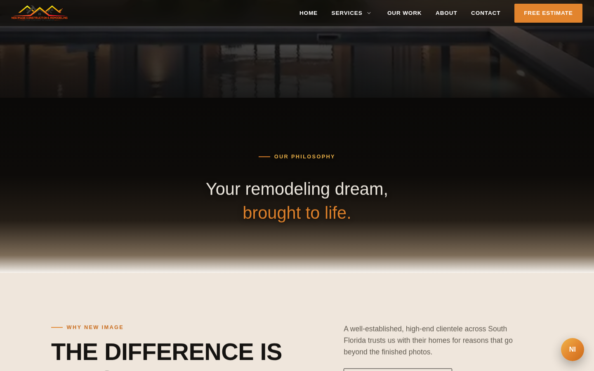

---

## 3. "Why New Image" — tarjetas con vida propia

Cuatro diferenciadores reales de la empresa (nada de cifras inventadas),
con su propio CTA. Cada tarjeta tiene una barra de acento naranja-a-dorado
siempre visible, y al pasar el mouse se eleva, brilla y el número toma
color:

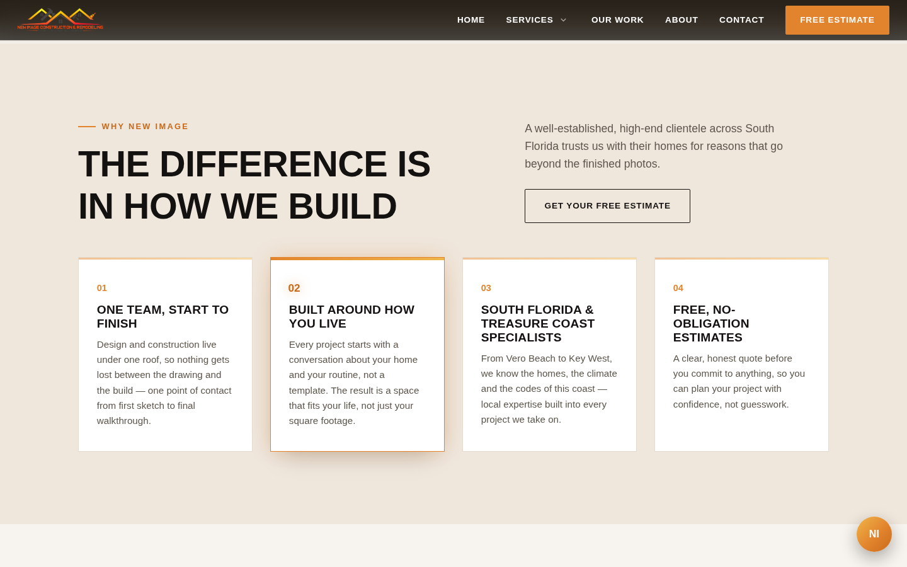

---

## 4. Catálogo de servicios en mosaico

Grid fotográfico con jerarquía visual (una tarjeta destacada más grande),
en vez de una lista plana de servicios:

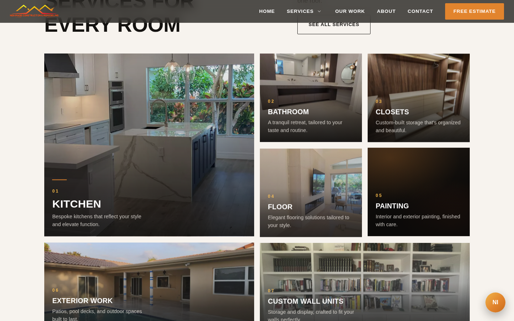

---

## 5. "Three Steps, One Team" — el proceso, explicado

Concept → Build → Transform, la misma idea del hero, ahora como una
sección propia con más contexto y un CTA de estimado gratis. Mismo
lenguaje visual de tarjetas animadas que "Why New Image":

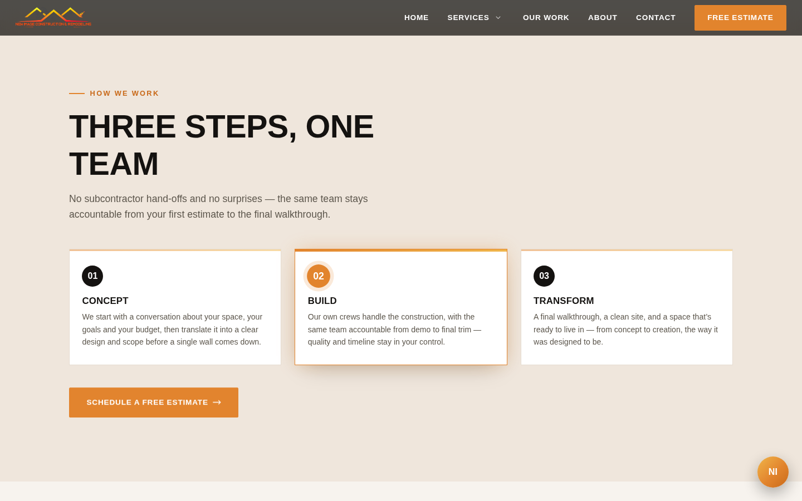

---

## 6. Galería de trabajos recientes

Masonry con proyectos reales (cocinas, baños, closets, exteriores):

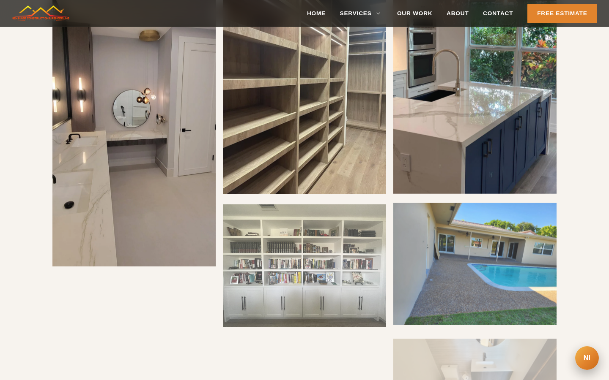

---

## 7. Banner de zona de cobertura

Foto real de un proyecto terminado como fondo, con la zona de servicio
("Vero Beach to Key West") en las propias palabras del cliente — refuerza
confianza sin inventar datos:

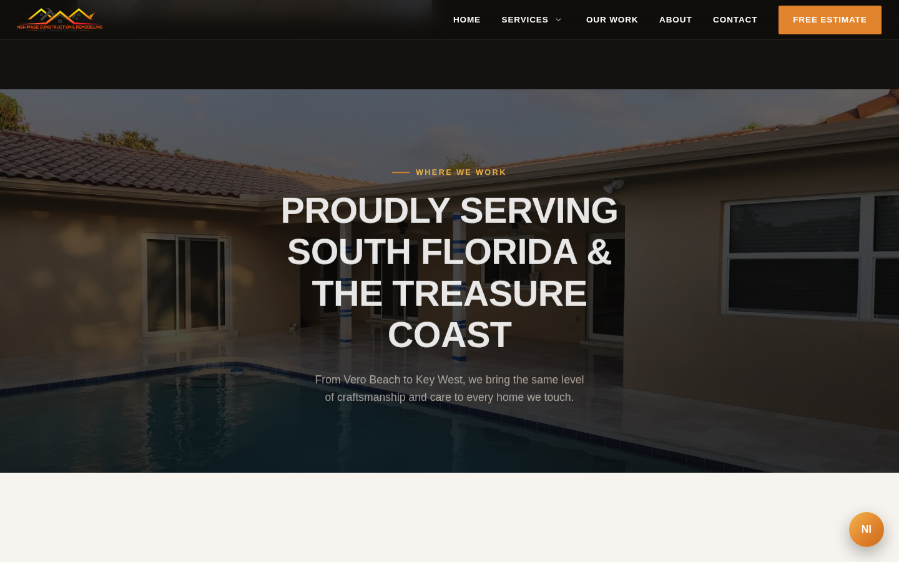

---

## 8. Cierre con tres formas de contacto

Programar estimado, WhatsApp o llamar — tres botones, no uno solo:

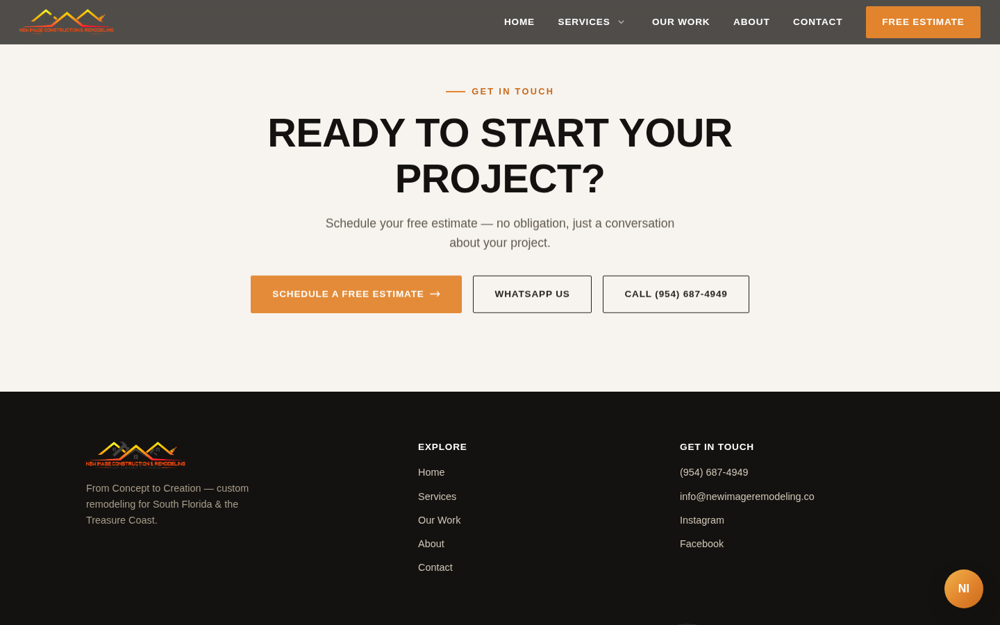

---

## 9. Asistente "NI" — ayuda rápida con texto libre

Botón flotante que abre un mini-chat: el visitante escribe su pregunta
("¿trabajan en Key West?", "¿cuánto cuesta una cocina?") y el asistente
responde con datos reales del sitio (servicios, proceso, zona, contacto).
No es IA conectada a un servidor — es coincidencia de palabras clave
100% del lado del cliente, honesto sobre sus límites cuando no reconoce
la pregunta:

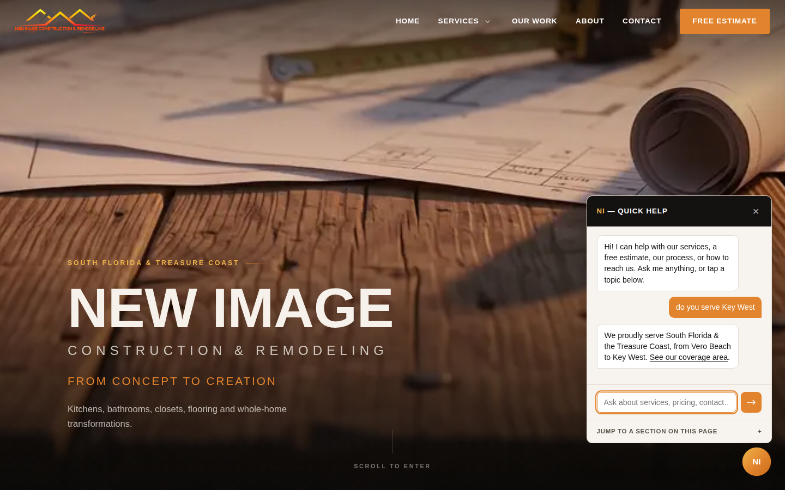

---

## 10. Todo funciona igual de bien en móvil

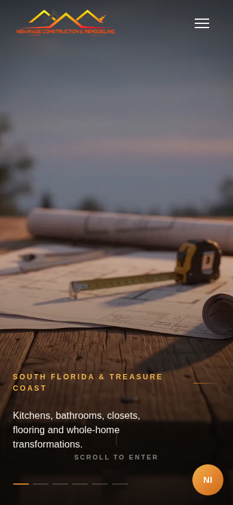 | 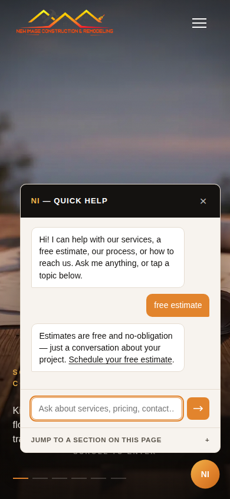
:--:|:--:

---

### En resumen

Lo que hace especial a este sitio no es un solo efecto, sino que varias
piezas trabajan juntas hacia el mismo objetivo (vender, no solo informar):
una narrativa cinemática de entrada, contenido de venta honesto (sin cifras
ni reseñas inventadas), múltiples puntos de contacto repartidos por toda la
página, y un asistente que ayuda al visitante a encontrar lo que busca sin
necesitar un backend.
